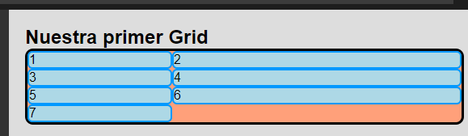
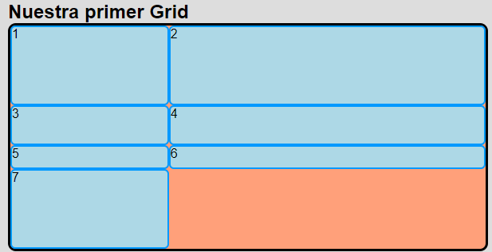
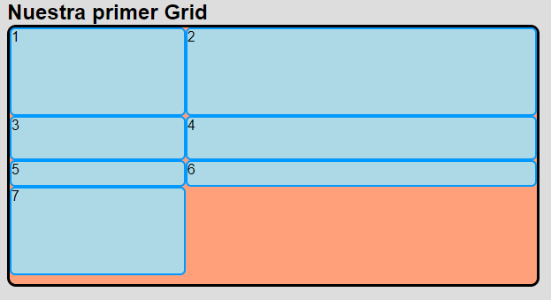
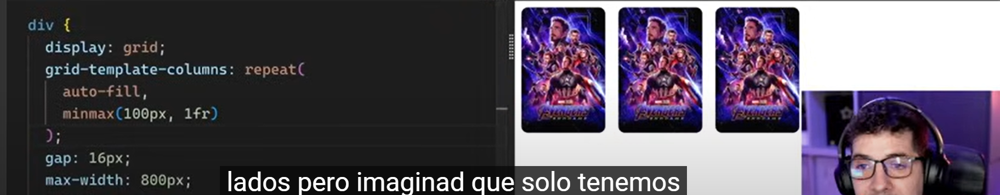
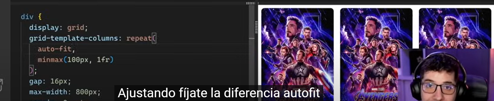
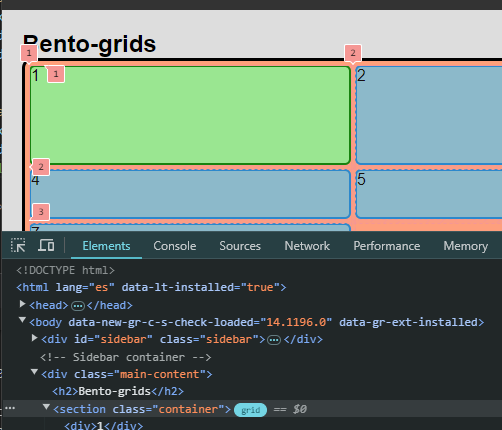

### Fracción (`fr`)

Es una unidad especial que solo funciona con Grid y te permite indicar el tamaño de las columnas de forma proporcional utilizando fracciones (`fr`).

- **Ejemplos**:
  ```css
  grid-template-columns: 1fr; /* 100% */
  grid-template-columns: 1fr 1fr; /* 50% 50% */
  grid-template-columns: 1fr 1fr 1fr; /* 33.33% 33.33% 33.33% */
  ```
  Usar fracciones (`fr`) es mucho más simple que usar porcentajes, ya que se ajusta automáticamente al tamaño disponible.

Si queremos que la segunda columna sea el doble que la primera, lo podemos hacer de esta forma:

```css
grid-template-columns: 1fr 2fr;
```



### Ajustar el tamaño de las filas

Podemos también cambiar el tamaño de las filas para que sea bidimensional.

- **Ejemplo**:
  ```css
  grid-template-rows: 100px 50px 100px 100px;
  ```
  Esto define:
  - La primera fila con 100px
  - La segunda con 50px
  - La tercera con 100px
  - La cuarta con 100px



### Importante: Filas sin contenido

Es posible que tengas filas sin elementos dentro. La cuadrícula puede estar creada aunque no veas un elemento dentro.

- **Ejemplo**:
  ```css
  grid-auto-rows: 100px;
  ```
  Esto asegura que cada fila nueva creada automáticamente tendrá 100px de alto.



### Usar `minmax` en Grid

Podemos usar `minmax` para definir un tamaño mínimo y máximo para las columnas. Por ejemplo:

```css
grid-template-columns: minmax(100px, 1fr) 1fr 1fr;
```

Esto significa que la primera columna tendrá al menos 100px, pero se expandirá si hay espacio suficiente, hasta ocupar una fracción (`fr`).

**Nota:** Si el 33.33% del espacio disponible es menor que 100px, la columna se quedará en 100px.

### Diferencias entre `auto-fill` y `auto-fit`

- **`auto-fill`**: Coloca tantas columnas como sea posible, manteniendo el ancho mínimo especificado (en este caso 100px).
- **`auto-fit`**: Se ajusta al espacio disponible, estirando el contenido hasta los límites del contenedor. Es útil cuando tienes pocas imágenes, ya que ajusta el contenido para que ocupe todo el espacio disponible.

- **Ejemplos**:

  - **`auto-fill`** (deja espacio en blanco, es lo más recomendable):
    

  - **`auto-fit`** (ajusta y estira el contenido):
    

### Bento Grid

Una visualización de la estructura de las celdas de una cuadrícula.


### Usar la consola de Google Chrome

Podemos usar los números que nos muestra la consola de Google Chrome para saber dónde comienzan y terminan los elementos. Esto nos ayuda a determinar dónde queremos que empiecen y terminen en la cuadrícula.



---

Con estas mejoras, el texto debería ser más claro y organizado para quienes estén aprendiendo sobre CSS Grid.
